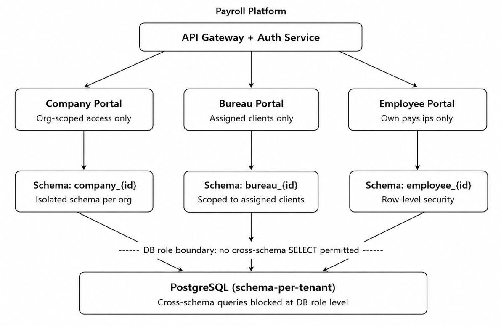
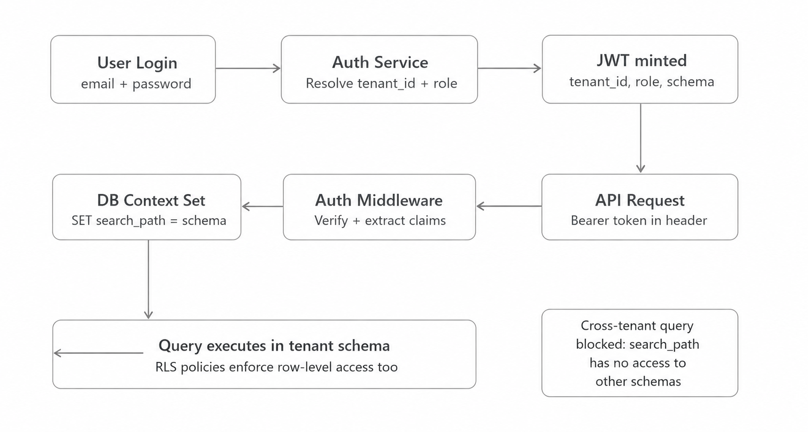
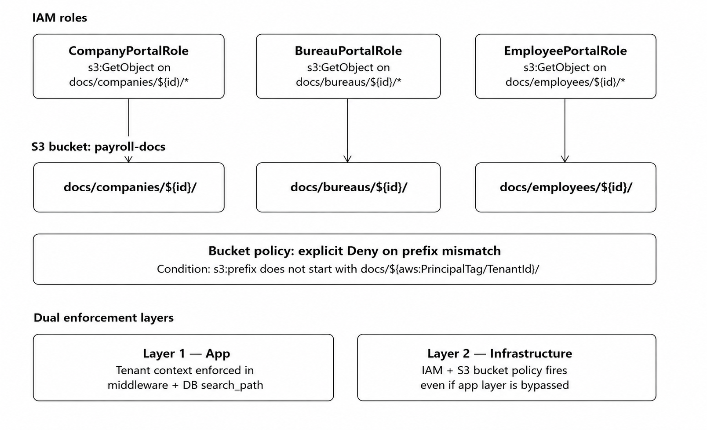

## 2a. Tenant Isolation Strategy

**Chosen model:** Schema-per-tenant on a shared PostgreSQL instance.

Given the sensitivity of payroll data, a full database-per-tenant would be ideal in theory but is operationally prohibitive at scale (hundreds of connections, migrations across thousands of databases). A flat shared database with `tenant_id` columns is the worst option - it relies entirely on application-level filtering, with no structural guarantee. Schema-per-tenant sits in the right middle ground: strong structural isolation enforced at the database level, manageable operational overhead, and the ability to use PostgreSQL's native row-level security (RLS) as a second line of defence.

- Each **Company** gets schema: `company_{uuid}`
- Each **Bureau** gets schema: `bureau_{uuid}`
- Each **Employee's** sensitive payroll rows are RLS-protected within the Bureau's schema they belong to

### How Tenant Context is Established and Propagated



At login, the auth service looks up the user's record, resolves their `tenant_id`, role (`company | bureau | employee`), and their assigned `schema_name`. These three claims are signed into a short-lived JWT (15 min) with a refresh token stored server-side (so it can be revoked).

Every subsequent API request carries that JWT. A mandatory middleware layer - applied before any controller logic - verifies the signature, extracts claims, and immediately issues `SET search_path = '<tenant_schema>'` on the database connection. This means even if a developer forgets to add a `WHERE tenant_id = ?` clause, the query physically cannot reach another tenant's tables.

Rows within the Employee schema are additionally protected by a PostgreSQL RLS policy:

```sql
USING (employee_id = current_setting('app.current_employee_id'))
```

---

## 2b. Access Boundaries at the Infrastructure Layer

### IAM Role Design



Three IAM roles are defined - `CompanyPortalRole`, `BureauPortalRole`, and `EmployeePortalRole`. Each role carries an IAM policy granting `s3:GetObject` only on its own prefix pattern (e.g. `docs/companies/${aws:PrincipalTag/TenantId}/*`). The role itself is assumed by the application service at request time via STS, scoped to the authenticated tenant's ID using session tags.

The S3 bucket carries an explicit **Deny** bucket policy: any `s3:GetObject` call where the requested prefix does not begin with the caller's `PrincipalTag/TenantId` is denied outright, regardless of the IAM role policy. This means even if the application incorrectly constructs a URL pointing to another tenant's prefix, S3 itself blocks the request - no application bug can bridge the gap.

For RDS, a dedicated PostgreSQL role per tenant type is created:

```sql
GRANT USAGE ON SCHEMA company_{id} TO company_role_{id}
```

No role has any privilege on schemas it doesn't own. STS session tagging propagates the `tenant_id` into CloudWatch logs for full auditability.

---

## 2c. Tenant Onboarding & Offboarding

### Onboarding

*What happens when a new Company or Bureau is provisioned:*


Onboarding is a single **atomic provisioning job** (triggered via an internal admin API or a queue event) that runs these steps in a transaction:

1. A UUID is generated and stored in the `tenants` table
2. `CREATE SCHEMA company_{uuid}` is executed
3. All table migrations are applied within that schema
4. A dedicated DB role is created with `GRANT USAGE ON SCHEMA` scoped only to that new schema
5. An IAM role is created (or a named role is tagged with `TenantId = uuid`)
6. The S3 prefix `docs/companies/{uuid}/` is initialised

Only after all steps succeed does the system send the admin invite email. The tenant is isolated from the moment it exists - there is no interim state where it can see another tenant's data, because the schema is empty and no cross-schema privileges are ever granted.

### Offboarding

Offboarding begins with an **audit record** (who requested it, when, why) and is immediately followed by **session revocation** - all refresh tokens for the tenant are deleted from the token store, making all active JWTs non-refreshable. Then:

- IAM role policy attachments are removed and an explicit `Deny *` is added to the S3 bucket policy for that prefix
- The DB role has all grants revoked

After a configurable **retention period** (typically 90 days for payroll compliance, or as required by local regulation), a scheduled job:

- Executes `DROP SCHEMA company_{uuid} CASCADE`
- Sets an S3 lifecycle rule to expire all objects under the prefix

The audit record itself - timestamps, who acted, what was deleted - is written to an **append-only audit log** table in a dedicated `audit` schema that no tenant role can write to or delete from, retained for **seven years**.
