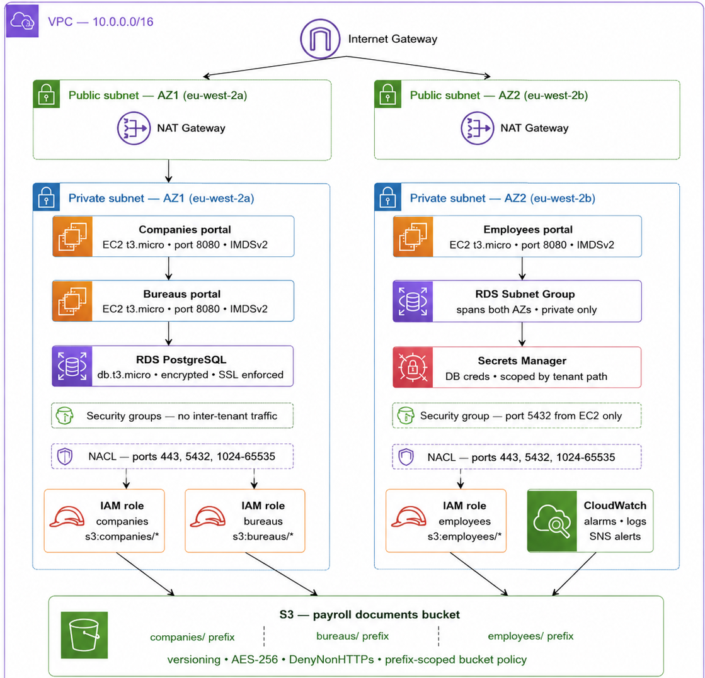

# Payroll Platform Infrastructure

A complete AWS infrastructure implementation for a multi-tenant UK payroll platform,  
built with Terraform, GitHub Actions, and Docker.

This repository covers:
- Infrastructure provisioning
- Security hardening
- CI/CD pipelines
- Monitoring
- UK GDPR compliance

---

# Architecture Overview


The platform runs on AWS `eu-west-2` (London) — chosen for UK data residency compliance.

Three tenant types:
- Companies
- Bureaus
- Employees

These are isolated at:
- Compute layer
- Network layer
- Database layer
- IAM layer

All services run in private subnets with no public exposure.

---

# Repository Structure

```text
.
├── terraform/                  # Core AWS infrastructure (Terraform)
│   ├── main.tf                 # Root module — wires all modules together
│   ├── variables.tf            # Input variables
│   ├── outputs.tf              # Root outputs
│   ├── providers.tf            # AWS + random providers
│   ├── terraform.tfvars        # Dev environment values
│   ├── plan_output.txt         # Terraform plan output for review
│   └── modules/
│       ├── vpc/                # VPC, subnets, IGW, NAT, NACLs
│       ├── compute/            # EC2 instances + security groups per tenant
│       ├── database/           # RDS PostgreSQL + Secrets Manager
│       ├── storage/            # S3 bucket + bucket policies
│       └── iam/                # IAM roles + policies per tenant
│
├── .github/workflows/
│   ├── deploy-companies.yml    # CI/CD pipeline — Companies portal
│   ├── deploy-bureaus.yml      # CI/CD pipeline — Bureaus portal
│   └── deploy-employees.yml    # CI/CD pipeline — Employees portal
│
├── docker/app/
│   ├── Dockerfile              # Production-grade container image
│   ├── main.py                 # Flask placeholder service
│   └── requirements.txt
│
├── monitoring/
│   └── cloudwatch.tf           # CloudWatch alarms, log groups, SNS
│
├── scripts/
│   └── deploy.sh               # EC2 deployment script via SSM
│
└── docs/
    ├── Task2README.md          # Multi-tenancy architecture detail
    ├── Task3README.md          # Security & access control detail
    ├── Task5README.md          # Monitoring & incident readiness detail
    ├── Task6README.md          # UK compliance detail
    ├── secret_injection_example.py
    ├── ai_log.md               # Mandatory AI usage log
    └── mdimages/               # Architecture diagrams

---

## Setup Instructions

### Prerequisites
- Terraform >= 1.5.0
- AWS CLI configured with valid credentials
- AWS account with free tier access

### 1. Configure AWS credentials
```bash
aws configure
# Enter your Access Key ID, Secret Access Key, region: eu-west-2
```

### 2. Initialise Terraform
```bash
cd terraform
terraform init
```

### 3. Review the plan
```bash
terraform plan
# Full plan output saved in terraform/plan_output.txt for reference
```

### GitHub Actions Setup
Add the following secrets to your GitHub repository settings:

| Secret | Description |
|--------|-------------|
| `AWS_ACCESS_KEY_ID` | AWS IAM access key |
| `AWS_SECRET_ACCESS_KEY` | AWS IAM secret key |
| `GHCR_TOKEN` | GitHub personal access token for container registry |
| `COMPANIES_INSTANCE_ID` | EC2 instance ID from terraform output |
| `BUREAUS_INSTANCE_ID` | EC2 instance ID from terraform output |
| `EMPLOYEES_INSTANCE_ID` | EC2 instance ID from terraform output |

---

## Tasks Summary

### Task 1 — AWS Infrastructure Setup
Full Terraform implementation across 5 modules. See `terraform/plan_output.txt`
for the complete plan output showing all resources planned.

Key decisions:
- Resource-type modules over tenant-based modules — tenants share VPC and RDS,
  splitting by tenant would duplicate shared infrastructure unnecessarily
- eu-west-2 (London) hardcoded in providers.tf — UK data residency requirement
- IMDSv2 enforced on all EC2 instances — prevents SSRF credential theft via
  metadata endpoint
- Employees EC2 in AZ2, others in AZ1 — distributes across availability zones
  for resilience at no extra cost

### Task 2 — Multi-Tenancy Architecture
Schema-per-tenant isolation model chosen over shared tables or database-per-tenant.
A query running in the wrong schema returns zero rows by design — not by accident.

→ Full detail in [docs/Task2README.md](docs/Task2README.md)

### Task 3 — Security & Access Control
Least-privilege IAM with explicit Deny statements, Secrets Manager for all
credentials, encryption at rest on RDS/S3/EBS, SSL enforced at database level,
DenyNonHTTPS on S3 bucket policy.

→ Full detail in [docs/Task3README.md](docs/Task3README.md)

### Task 4 — CI/CD Pipeline
Three independent GitHub Actions workflows — one per tenant portal. Each pipeline
builds, tests, and deploys without interfering with other tenant deployments.
Uses GitHub Container Registry (free) over ECR. Deploys via AWS SSM — no open
SSH ports required.

Key decisions:
- Three separate workflow files over one shared workflow — a syntax error in a
  shared workflow breaks all three deployments simultaneously
- Path filters on each workflow — pushing companies code never triggers a
  bureaus deployment
- Health check with automatic rollback in deploy.sh — if the container fails
  after deployment it stops itself before traffic reaches it
- github.sha as image tag — every deployment is traceable to an exact commit

Pipeline run history visible in GitHub Actions tab showing all three portals
running independently.

### Task 5 — Monitoring & Incident Readiness
CloudWatch alarms for EC2 CPU, RDS connections, RDS CPU, and RDS free storage.
EventBridge rule watching specifically for RDS-EVENT-0088 — fires when RDS is
made publicly accessible. SNS email alerts with recovery notifications.

→ Full detail in [docs/Task5README.md](docs/Task5README.md)
→ Incident response runbook in [docs/Task5README.md#runbook](docs/Task5README.md)

### Task 6 — UK Compliance
AWS-native GDPR controls, eu-west-2 data residency enforcement, and right to
erasure process covering database anonymisation, S3 versioned object deletion,
Secrets Manager, and CloudWatch logs. Includes HMRC 3-year retention conflict
resolution via Article 17(3) exemption.

→ Full detail in [docs/Task6README.md](docs/Task6README.md)

---

## Trade-offs Considered

| Decision | Chosen | Rejected | Reason |
|----------|--------|----------|--------|
| Tenancy model | Schema-per-tenant | Shared tables / DB-per-tenant | Shared tables risk cross-tenant leakage on missing WHERE clause. DB-per-tenant exceeds free tier. |
| Module structure | Resource-type modules | Tenant-based modules | Tenants share VPC and RDS — tenant modules would duplicate shared infrastructure |
| Container registry | GHCR (free) | AWS ECR | Assignment requires no paid registry. GHCR is free with GitHub account |
| Multi-AZ RDS | Disabled for dev | Enabled | Cost — db.t3.micro multi-AZ doubles RDS cost. Would enable in production |
| Deployment method | SSM send-command | SSH | SSM requires no open inbound ports. SSH requires port 22 exposed |
| CI/CD structure | 3 separate workflows | 1 shared workflow | Independent deployments, isolated failure blast radius per team |
| NAT Gateway | Single in AZ1 | One per AZ | Cost — second NAT Gateway doubles NAT cost. Single NAT is acceptable for dev |

---

## AI Usage

AI tools were used throughout this assignment. Full prompt log, key outputs taken,
and all adaptations and rejections documented in:

→ [docs/ai_log.md](docs/ai_log.md)